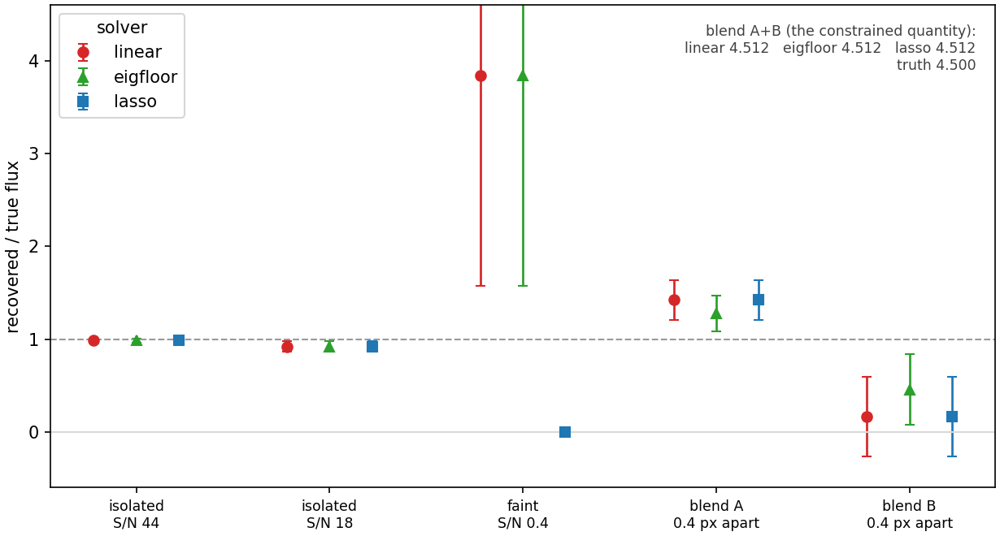

<p align="center">
  
</p>

<p align="center">
  <a href="https://github.com/hbahk/tractor-jax/actions/workflows/ci.yml">
    </a>
  <a href="https://tractor-jax.readthedocs.io/en/latest/">
    </a>
  <a href="https://www.gnu.org/licenses/old-licenses/gpl-2.0">
    </a>
  
</p>

**GPU-accelerated astronomical image modeling and forced photometry.**

Tractor-JAX reimplements [The Tractor](https://github.com/dstndstn/tractor)
(Lang & Hogg) on JAX. It keeps the model classes you already know — `Image`,
`Catalog`, `PointSource`, `SersicGalaxy`, `PixelizedPSF` — and replaces the
fitting engine with batched, `jit`-compiled kernels that solve thousands of
blended sources per image on a GPU, with exact autodiff gradients and a menu of
regularized estimators.

Built for SPHEREx-scale forced photometry: many epochs, many bands, deeply
crowded fields, fluxes free and everything else frozen.

## Features

- **Batched GPU rendering and solves** — every image or tile padded to a common
  shape and solved in one `vmap`, with the compiled solver memoized across calls.
- **A menu of estimators** — plain weighted least squares, an eigenvalue floor
  for degenerate blends, Gaussian flux priors, and L1 with selection and
  debiasing. See [choosing a solver](https://tractor-jax.readthedocs.io/en/latest/solvers.html).
- **Undersampling handled correctly** — sources are rendered on an oversampled
  grid and integrated back to native pixels; flux conservation is a tested
  contract.
- **Scales across devices** — data-parallel sharding over the image batch (~99%
  efficiency on two GPUs) plus a prefetch pipeline that hides host work behind
  the accelerator.
- **Exact gradients** through the full image model via JAX autodiff.

## Installation

```bash
git clone https://github.com/hbahk/tractor-jax.git
pip install -e tractor-jax
```

`pip install jax` gives a CPU-only build; for GPU install a CUDA wheel
(`pip install "jax[cuda12]"`). Python ≥ 3.11. No C extensions and no
`astrometry.net` dependency.

## Quickstart

```python
import numpy as np
from tractor_jax import (Tractor, Image, Catalog, PointSource, PixPos, Flux,
                         NCircularGaussianPSF)
from tractor_jax.jax.optimizer import optimize_fluxes

catalog = Catalog(PointSource(PixPos(24.0, 27.0), Flux(100.0)),
                  PointSource(PixPos(31.0, 18.0), Flux(40.0)))
image = Image(data=data, inverr=np.full(data.shape, 1 / 0.5),
              psf=NCircularGaussianPSF([1.5], [1.0]))

tractor = Tractor([image], catalog)
fluxes, variances = optimize_fluxes(
    tractor, solver="eigfloor", return_variances=True)[0]
```

The [worked example](https://tractor-jax.readthedocs.io/en/latest/worked_example.html)
(`examples/fit_blended_sources.py`, runs on CPU in a couple of minutes) fits an
undersampled SPHEREx-like scene of stars and galaxies with a degenerate blend
and an undetected source, showing where the estimators agree and where they
don't:

<p align="center">
  
</p>

## Performance

Production SPHEREx run — 100×100 pixel cutouts, ~3700 sources each, 1× NVIDIA
L40S, float32. The reference is the legacy CPU Tractor as deployed (plain forced
photometry, one pinned core): **10.77 s/cutout**.

| solver | pipelined ms/cutout | 1 GPU ≈ N legacy cores |
|---|---|---|
| `linear` | 55.1 | **195** |
| `lasso` | 75.8 | 142 |
| `eigfloor` | 154.6 | 70 |
| `eigfloor_prior` | 171.2 | 63 |

Node-level: **1 GPU = 9.95 cutouts/s** against a 56-core legacy pool at
1.58–2.06 cutouts/s (**6.3× / 4.9× per node**). **Two GPUs scale at 99.4%.** The
`linear` row is the strict same-estimator comparison; the other rows compare our
production estimators against that deployed baseline and are conservative.

> [!WARNING]
> **CPU is not a fallback.** The same code on CPU is *slower* than the legacy
> Tractor (34 s/cutout on one core; 6.3 s on a full 56-core node). The speed
> here is a GPU + batching co-design, not "JAX being fast". On CPU-only
> hardware, use the legacy Tractor. See
> [performance](https://tractor-jax.readthedocs.io/en/latest/performance.html).

## Documentation

<https://tractor-jax.readthedocs.io> —
[quickstart](https://tractor-jax.readthedocs.io/en/latest/quickstart.html) ·
[worked example](https://tractor-jax.readthedocs.io/en/latest/worked_example.html) ·
[choosing a solver](https://tractor-jax.readthedocs.io/en/latest/solvers.html) ·
[how it works](https://tractor-jax.readthedocs.io/en/latest/architecture.html) ·
[performance](https://tractor-jax.readthedocs.io/en/latest/performance.html) ·
[coming from The Tractor](https://tractor-jax.readthedocs.io/en/latest/migration.html)

Build locally: `pip install -e ".[docs]" && sphinx-build -b html docs docs/_build/html`.

## Tests

```bash
JAX_PLATFORMS=cpu pytest tests/ -q
```

CPU-only, about a minute. The suite pins the engine's contracts: padded batches
solve identically to per-view builds, tiled matches untiled, the solver factory
is bit-identical to a hand-rolled `jit(vmap(...))`, the downsampler conserves
flux, and the lasso path matches an independent KKT oracle and scikit-learn.

## Downstream

[spherex-photometry](https://github.com/hbahk/spherex-photometry) wraps this
engine into an end-to-end SPHEREx L2 forced-photometry pipeline.

## History and provenance

Extracted from The Tractor and rewritten around JAX. The pre-history is
preserved in [`hbahk/tractor-jax-forked`](https://github.com/hbahk/tractor-jax-forked);
the original lives at [`dstndstn/tractor`](https://github.com/dstndstn/tractor).

## License

GPL-2.0-only. Tractor-JAX is a derivative work of The Tractor, which is
licensed under the GPLv2 (version 2 only), so this package is distributed
under the same terms. See `LICENSE` and `COPYING`.
